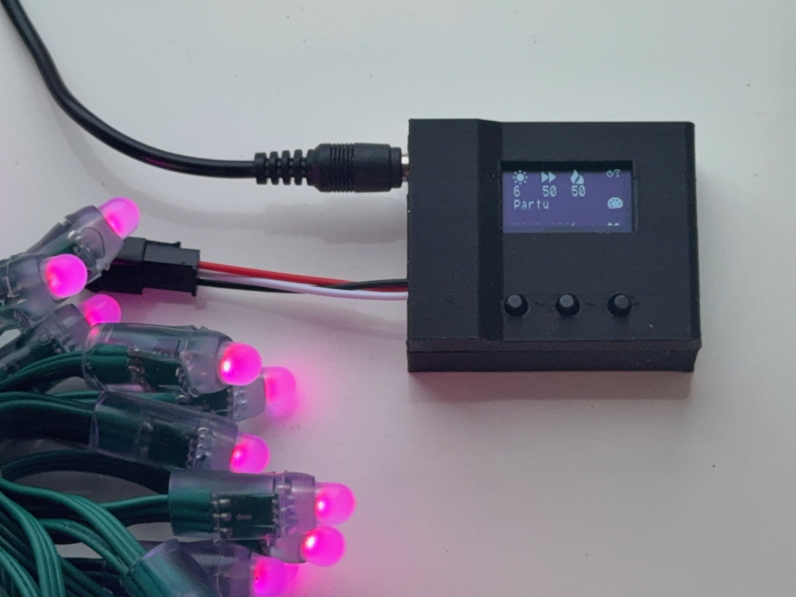
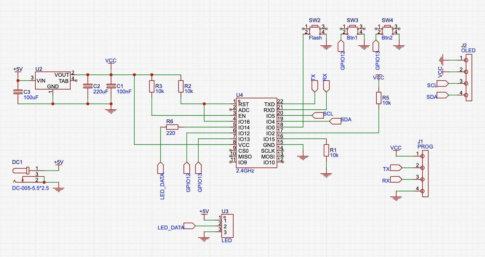
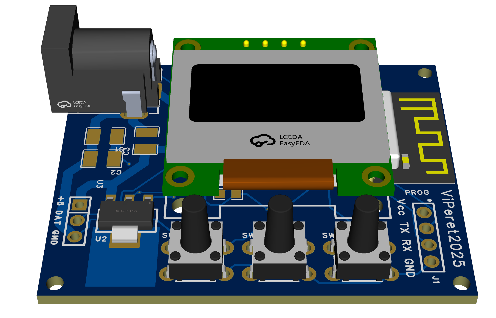
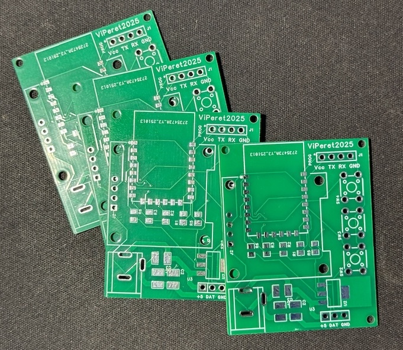
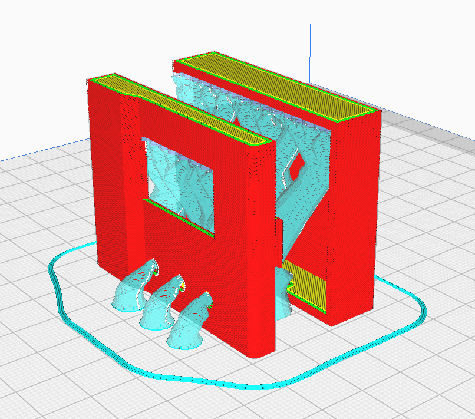
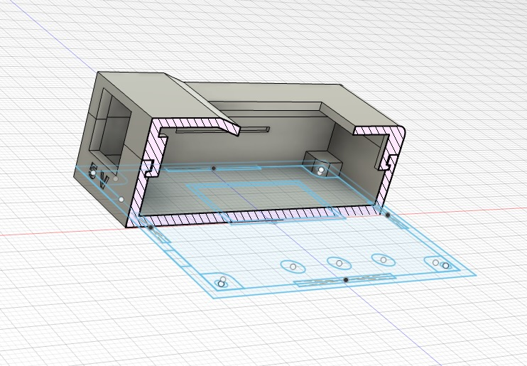
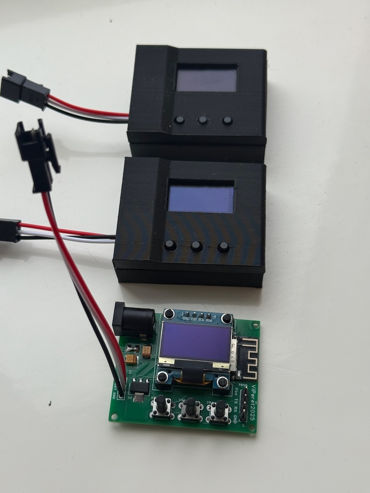

# ESP8266 WLED controller with OLED display

This project describes a custom ESP8266 WLED controller with integrated 0.96" OLED display. And 3-button interface for easy control of WLED features. Firmware is based on WLED-MM fork with custom modifications to support 3-button control (instead of rotary encoder).



## PCB Design







Schematic and PCB design files are created using EasyEDA and can be found in the `pcb` directory.
- [EasyEDA Project](pcb/WLED_OLED_2025-11-16.epro) (also available online at  https://oshwlab.com/viperet/wled)
- [Gerber Files](pcb/Gerber_PCB2_2025-11-16.zip) (for manufacturing, I ordered my PCBs from JLCPCB, $4.31
for 5 pieces)
- [PCB PDF, for DIY toner transfer method](pcb/PCB_PCB2_2025-11-16.pdf)

## Bill of Materials (BOM)

| Component                            | Quantity | Price (approx.) | Link   |
|--------------------------------------|----------|-----------------|--------|
| ESP8266 (ESP-12F)                    | 1        | $1.74           | [Aliexpress](https://www.aliexpress.com/item/1005009043560818.html) |
| 0.96" I2C OLED Display               | 1        | $1.62           | [Aliexpress](https://www.aliexpress.com/item/1005008738379315.html) |
| 6x6x12mm Tactile Push Buttons        | 3        | $0.08 each      | [Aliexpress](https://www.aliexpress.com/item/1005003115135192.html) |
| 5.5x2.5mm DC Power Socket            | 1        | $0.50           | [Aliexpress](https://www.aliexpress.com/item/1005001421234567.html) |
| 5V 2A Power Supply.                  | 1        | $1.31           | [Aliexpress](https://www.aliexpress.com/item/1005002466317273.html) |
| AMS1117 3.3V Voltage Regulator       | 1        | $0.06           | [Aliexpress](https://www.aliexpress.com/item/1005007545374135.html) |
| 3 Pin SM JST Connector (for LEDs)    | 1        | $0.84           | [Aliexpress](https://www.aliexpress.com/item/1005007349974108.html) |
| 4 Pin Male Header (for programming)  | 1        | $0.18           | [Aliexpress](https://www.aliexpress.com/item/1005005992568640.html) |
| 10k Ohm Resistor                     | 4        | $0.01           | [Aliexpress](https://www.aliexpress.com/item/1005003413960273.html) |
| Tantalum Capacitors (220uF, 100uF)   | 2        | $0.07 each      | [Aliexpress](https://www.aliexpress.com/item/1005006418482732.html) |
| Ceramic Capacitor (100nF)            | 1        | $0.01 each      | [Aliexpress](https://www.aliexpress.com/item/1005008619931853.html) |
| PCB manufacturing                    | 1        | $0.87           | [JLCPCB](https://jlcpcb.com/) |
| **Total Estimated Cost**             |          | **~$7.50**      |        |

Recommended LED strips: [50pcs WS2811 DC 5V](https://www.aliexpress.com/item/32216500548.html) ~$11.30 per 50 leds. This controller can handle up to 100 LEDs (2 strips connected in series) without injecting additional power.

## Assembly Recommendations

- Solder the voltage regulator and capacitors first
- Solder DC power socket, connect the power supply and verify that 3.3V is present on flashing header
and 5V on the LED output header
- Solder SMD resistors next, you can replace 220 Ohm resistor in the LEDs DATA line with the solder jumper.
- Solder the ESP8266 module, ensure correct alignment of the module with the silkscreen outline on the PCB.
- Carefully install and solder 3 buttons. Ensure all 4 pins of each button are soldered properly.
- Solder LEDs connector.
- Install and solder flashing header.
- Clean all flux residues from the PCB using isopropyl alcohol (**Important**).
- Flash WLED firmware (see instructions below). Disconnect the USB-TTL adapter after flashing and power the device using 5V DC power supply. Connect LEDs and test functionality. Check that all buttons work as intended before soldering the OLED display.
- Attach 4 small OLED display spacers (see 3d model link below) to the display using superglue or just melt plastic using soldering iron tip. Since 0.96" OLED displays from different manufacturers may have slightly different dimensions, spacers are only attached to the display (they might not align perfectly with the holes on the PCB).
- Solder the OLED display to the PCB. Take extra care when handling the display, it's very easy to damage it, for example crack the corners of the display glass.


## Firmware

The firmware is based on [WLED-MM](https://mm.kno.wled.ge/) fork with custom modifications to support 3-button control. [Compiled binary](firmware/esp8266_4MB_M.bin) can be flashed using esptool or similar tools.

Connect USB-TTL adapter to the 4-pin header on the PCB. Press and hold the left button while powering on the device to enter flashing mode. Command to flash the firmware using esptool:

```
esptool.py --port=/dev/cu.usbserial-21330 write_flash 0x0 esp8266_4MB_M.bin
```

Disconnect the USB-TTL adapter and power the device using 5V DC power supply. The device will create a WiFi access point named `WLED-AP`. Connect to it and configure your WiFi settings through the web interface. After connecting to your WiFi network, you can access the WLED web interface by entering the assigned IP address in your browser.

Now you can manually configure all WLED pins in the WLED web interface, or upload [my config file](firmware/wled_cfg.json) on "Security & Update setup" page, "Restore configuration" option in the WLED settings. After this you will need to re-configure your WiFi settings again.

Pin configuration used in this project:

| Setting Section        | Function                | Pin/Value        |
|------------------------|-------------------------|------------------|
| LED Preferences        | Data Pin                | 14               |
| Usermods (Pin Manager) | Pin SDA                 | 4                |
|                        | Pin SCL                 | 5                |
| 4LineDisplay           | OLED Type               | SSD1306 128x64   |
| Rotary-Encoder         | DT Pin (Left Button)    | 0                |
|                        | CLK Pin (Right Button)  | 13               |
|                        | SW Pin (Middle Button)  | 12               |


## Enclosure

The enclosure is designed using Fusion 360. Recommeded to be printed using PLA, tree supports touching the build plate, 0.2mm layer height.



Also you should print 4 small OLED display spacers to ensure proper fitment of the display on the PCB.

- [Fusion 360 Project](enclosure/enclosure.f3d)
- [STL for enclosure](enclosure/enclosure.stl)
- [3MF Cura Project for enclosure](enclosure/enclosure.3mf)
- [STL for OLED spacers](enclosure/display_stand.stl)
- [3MF for OLED spacers](enclosure/display_stand.3mf)

Ensure that all supports are removed from the printed parts before assembly.

PCB should fit snugly into the bottom part of the enclosure.
Then, carefully attach the top part of the enclosure, ensuring the buttons align properly with holes. It should snap together without the need for screws or glue. Don't force it too much to avoid damaging the printed parts.



Completed device should look like this:


